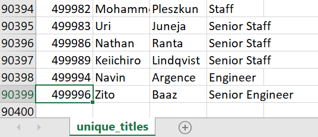
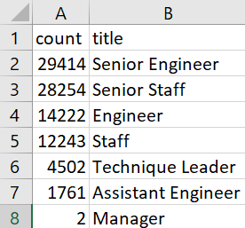
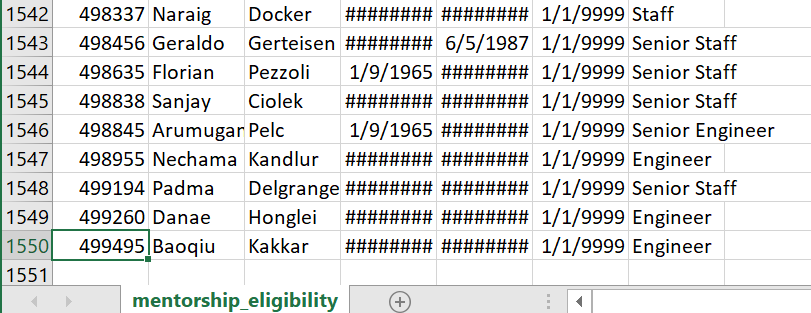

# Pewlett-Hackard-Analysis

## Overview of the Analysis
The purpose of this project is to perform employee research in order to determine who will be retiring from Pewlett Hackard in the next few years and how many positions the company will need to fill. 

## Results
- There are a total of 90,398 current employees born between January 1, 1952 and December 31, 1955.
    - 
- The title with the most upcoming employees who will be retiring is Senior Engineer with 29,414 employees.
    - 
- A total of 1,549 retiring employees are eligible for mentorship.
    - 
- 45,497 employees in the engineering department will be retiring. 

## Summary
- As the "silver tsunami" begins to make an impact, over 90,000 positions will need to be filled. More specifically, 29,414 Senior Engineer positions, 28,254 Senior Staff positions, 14,222 Engineer positions, 12,243 Staff positions, 4,502 Technique Leader positions, 1,761 Assistant Engineer positions, and 2 Manager positions.
- With only about 1,500 retirement-ready employees qualified to be mentors, there is a substantial lack of employees neede to mentor the next generation of Pewlett Hackard employees. If all positions are filled, each mentor will need to train up multiple new employees and new mentors will need to be added.
### Additional Queries
It would be interesting to look at the breakdown of how many mentorship-eligible employees are in each department. This would help determine how many new workers each mentor will need to tak eup based on their department, and how many additional mentors might need to be added. 
An additional piece of information that may be beneficial to this analysis is a breakdown of the number of employees retiring for each upcoming year. This would be good to plan out how many new employees to expect and how many mentors will be needed each year. 
